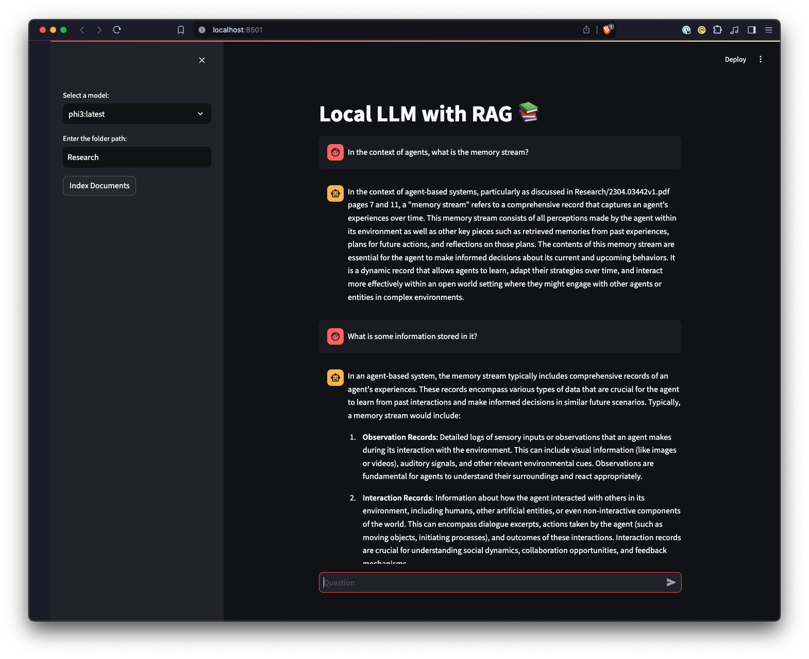

# Local LLM with RAG

<p align="center">
    
</p>

This project is an experimental sandbox for testing out ideas related to running local Large Language Models (LLMs) with [Ollama](https://ollama.ai/) and [Pydantic AI](https://ai.pydantic.dev/) to perform **agentic** Retrieval-Augmented Generation (RAG) for answering questions based on your documents. The agent can decide when and how to search documents, unlike fixed RAG pipelines. We use Ollama to create embeddings with [nomic-embed-text](https://ollama.com/library/nomic-embed-text) stored in [LanceDB](https://lancedb.com/) for vector search.

<p align="center">
    
</p>

## Requirements

- [Ollama](https://ollama.ai/) version 0.13.5 or higher.

## Setup

1. Clone this repository to your local machine.
2. Install UV using instructions from the Astral site, [Installation](https://docs.astral.sh/uv/#installation)
3. Create a virtual environment and install required Python packages by running `uv sync`

## Running the Application

Run the Streamlit application:

```bash
uv run streamlit run interfaces/streamlit_app.py
```

This will start a local web server and open a new tab in your default web browser. The UI allows you to select models, specify a document folder, and chat with your documents.

**Note:** The first time you run the project, it will download the necessary models from Ollama for the LLM and embeddings. This may take some time depending on your internet connection.

### Model Requirements

**Important:** The selected LLM must support **tool calling** (function calling). The application uses an agentic approach where the model decides when to search documents, which requires tool calling capability. Models without this feature will not work correctly—they may fail silently, output raw tool syntax, or ignore documents entirely.

Not all Ollama models support tool calling reliably. We tested several model families and sizes to find the best options for this RAG application.

**Recommended Models (Tested):**
- **qwen3:14b** - Best overall quality, excellent reasoning and document synthesis
- **qwen3:8b** - Best balance of speed and quality, minimum recommended size for reliable RAG

These Qwen3 models were tested extensively with compound questions requiring multiple document searches. Both handle tool calling reliably and produce accurate, well-formatted answers.

**Why Model Size Matters:**

Smaller models (under 8B parameters) struggle with agentic RAG tasks:
- They may fail to call the search tool when needed
- They often hallucinate instead of searching documents
- Some output raw tool syntax instead of executing searches

Our testing showed qwen3:8b as the minimum viable size. Smaller models like qwen3:4b and qwen3:1.7b had significant reliability issues with tool calling.

### Supported Document Formats

The application uses [MarkItDown](https://github.com/microsoft/markitdown) to load documents:
- PDF, Word (.docx), PowerPoint (.pptx), Excel (.xlsx)
- Markdown (.md), HTML, CSV, JSON

## Technologies Used

- [Pydantic AI](https://ai.pydantic.dev/): Type-safe agent framework with tool calling
- [Ollama](https://ollama.ai/): Platform for running Large Language Models locally
- [LanceDB](https://lancedb.com/): Vector database for storing and retrieving embeddings
- [MarkItDown](https://github.com/microsoft/markitdown): Microsoft's document converter for PDF, Office files, and more
- [Streamlit](https://streamlit.io/): Web framework for interactive applications
- [UV](https://astral.sh/uv): Fast Python package installer and resolver
